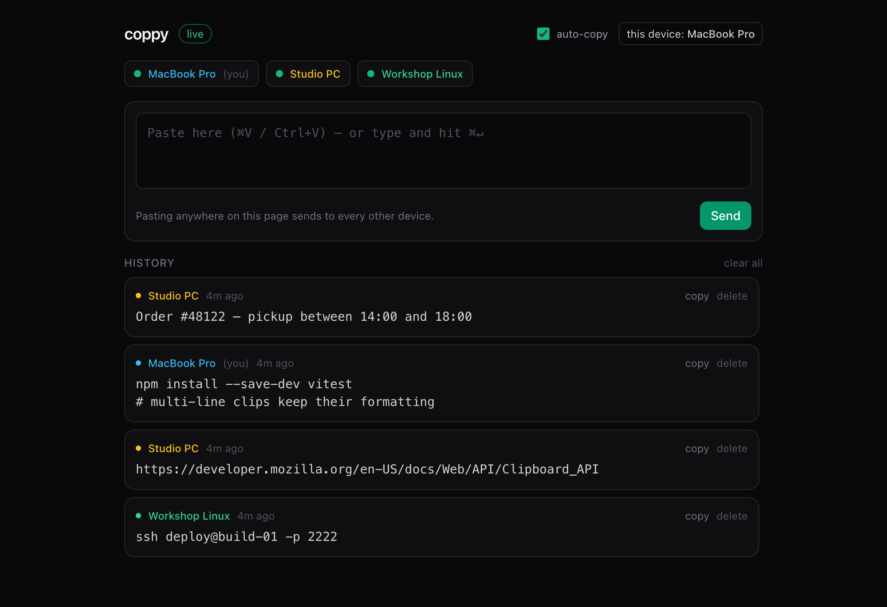

# coppy

A shared clipboard for the machines on your desk. Paste on one, it lands on the clipboard of every other one.

Zero npm dependencies, just plain `node:http`, Server-Sent Events for the push, and the built-in `node:sqlite` for persistence.



## Run

```bash
node server.js
```

It prints a `localhost` URL and a LAN URL. Open the LAN URL on every machine you want to sync (they must be on the same network).

`PORT` and `COPPY_DB` override the port (default `3737`) and database path (default `./coppy.db`).

## How it works

1. Copy something on computer A, switch to the coppy tab, hit Cmd-V / Ctrl+V anywhere on the page.
2. The text is stored and pushed over SSE to every connected browser.
3. Every device *except the sender* writes it to its own system clipboard.
4. The history shows every clip with the device it came from.

Typing into the box and pressing ⌘↵ / Ctrl+↵ (or clicking **Send**) does the same thing without needing a real paste.

### Device identity

No accounts. A device is identified by a `sha256(ip + user-agent)` fingerprint, stored in the `devices` table. A cookie holding the device's UUID is the primary key on later visits, so identity survives an IP change; the fingerprint is the fallback, so a device that loses its cookie still maps back to the same row.

Devices get an auto-generated label like `Chrome on macOS (192.168.1.42)`. Click **this device: …** in the header to rename it — the name is stored and shown on every clip that device ever sent.

Two browsers on the same machine count as two devices (different user-agent), which is handy for testing.

### Clipboard caveats

Writing to the system clipboard without a click is something browsers guard:

- **Chrome / Edge on `localhost` or the LAN IP**: works silently while the tab is focused.
- **Safari, and any unfocused tab**: the silent write is refused. coppy falls back to `execCommand('copy')`, and if that is refused too it shows a green bar at the bottom of the page: click it and the clip goes to your clipboard. A queued clip is also retried automatically the next time the tab regains focus.
- The **auto-copy** checkbox in the header turns automatic clipboard writes off entirely; the history and its per-item **copy** buttons still work.

Serving over plain HTTP on a LAN IP is not a secure context, so `navigator.clipboard` may be unavailable there, the `execCommand` fallback will cover it.

## Layout

| file               | what it does                                       |
| ------------------ | -------------------------------------------------- |
| `server.js`        | HTTP routes, SSE fan-out, device cookie handling   |
| `db.js`            | SQLite schema, fingerprinting, queries             |
| `public/index.html`| markup, Tailwind via CDN                           |
| `public/app.js`    | SSE client, paste capture, clipboard write + fallbacks |

## API

| method | path              | purpose                              |
| ------ | ----------------- | ------------------------------------ |
| GET    | `/api/state`      | current device, all devices, history  |
| GET    | `/api/events`     | SSE stream (`hello`, `clip`, `presence`, `device`, `clip-deleted`, `cleared`) |
| POST   | `/api/clips`      | `{ text }` → store and broadcast      |
| DELETE | `/api/clips/:id`  | delete one clip                       |
| DELETE | `/api/clips`      | clear history                         |
| PATCH  | `/api/device`     | `{ name }` → rename this device       |

There is no auth. Keep it on a network you trust.

## Roadmap

I don't know if I'll ever get there, but...

- [x] Copy text between devices. Fingerprint each device. Auto-copy upon new text arriving.
- [ ] Transfer files using modified QR-code via camera.
- [ ] Trasnfer files using encoded audio stream (speaker-to-mic).
- [ ] Make it work on mobile, too.